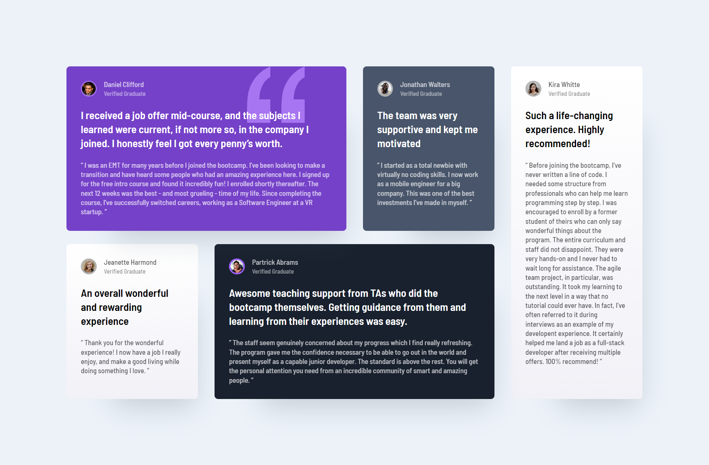

# Frontend Mentor - Testimonials grid section solution

This is a solution to the [Testimonials grid section challenge on Frontend Mentor](https://www.frontendmentor.io/challenges/testimonials-grid-section-Nnw6J7Un7). Frontend Mentor challenges help you improve your coding skills by building realistic projects. 

## Table of contents

- [Overview](#overview)
  - [Screenshot](#screenshot)
  - [Built with](#built-with)
  - [What I learned](#what-i-learned)
- [Author](#author)

## Overview
A Testimonial grid component.
### Screenshot

### Links

- Solution URL: [Add solution URL here](https://github.com/sanyomor-01/testimonials-grid-section-main)
- Live Site URL: [Live Site Vercel](https://testimonial-grid-flame.vercel.app/)

### Built with

- Semantic HTML5 markup
- CSS custom properties
- Flexbox
- CSS Grid
- Mobile-first workflow

### What I learned

I learned motion design  and basic CSS animation 

## Author

- Website - [Micheal](https://www.github.com/sanyomor-01)
- Frontend Mentor - [@yourusername](https://www.frontendmentor.io/profile/sanyomor-01)

